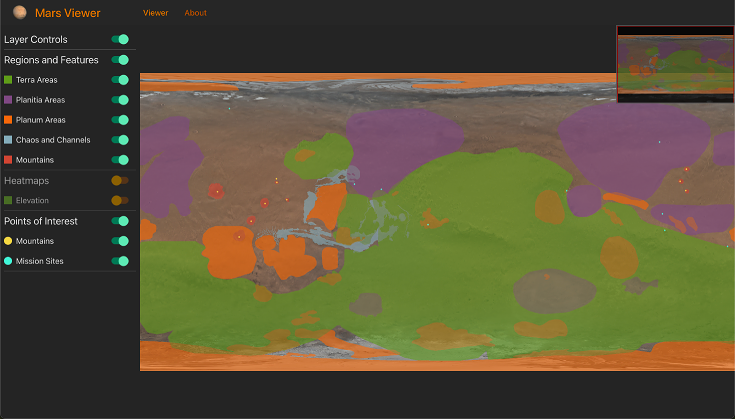
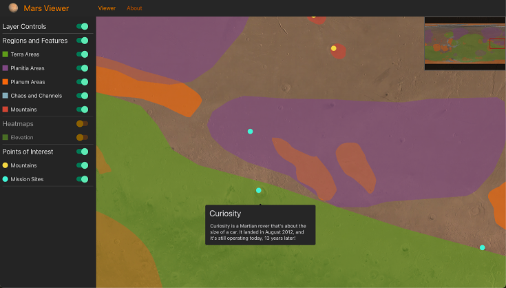
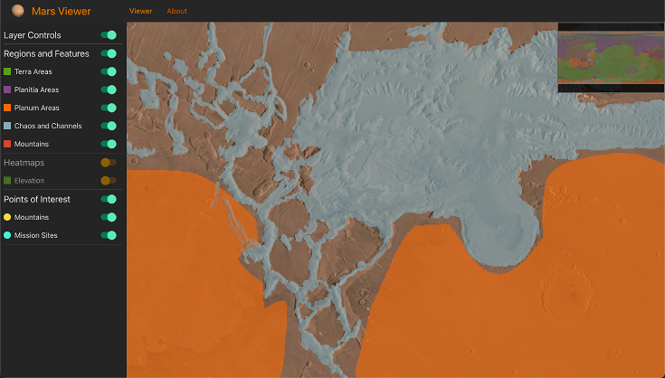
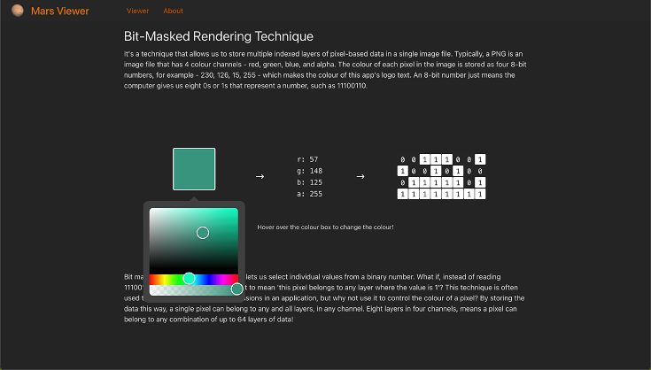

# Mars Viewer

#### A Mars Planetary Visualisation App

### https://mars-viewer-nu.vercel.app/
See it in action, hosted on Vercel!

## Preview

#### Viewer: Home Page

The viewer features multiple layers of visualisation, including pixel, point, and information tooltips.

#### Satisfy Your Curiosity!

Hovering over the points reveals information about a feature in that area. Can you find where Curiosity landed?

#### High Level of Detail

Bitmasked tiled images can have as much detail as your base layer of tiles. The limiting factor here is how large an image I can make with Photoshop!

#### Learn about Bit-masked Tiled Images

Learn about how the bit-masking technique works with the interactive explanation over on the about page!

## About

This is a portfolio app to demonstrate my skills with data visualization.

It uses OpenSeadragon to render deep zoom image, and it contains its own tiler server to serve it.

It should be paired with the mars-tiler repository. You can find that here:

https://github.com/Tobio89/mars-tiler

## Running the App

- Clone the repository
- Navigate to the base directory
- Use `yarn` to install the dependencies
- Run the app with `yarn dev`
